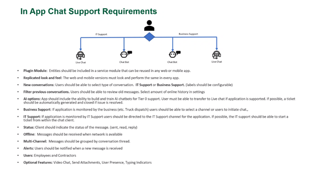

# Chat Module
The [chat module](#footnotes) provides an easy to use interface for [Azure Communication Services](https://azure.microsoft.com/en-us/services/communication-services/) that provides text, voice, SMS, and robotic communication.
  
# Features

- [x] User creation and authorization by username or issues a GUID for tracking anonymous clients
- [x] Multi-Channel
- [ ] [🚧](#footnotes) Plugin Mode
- [ ] [🚧](#footnotes) Message Receipts
- [ ] [🚧](#footnotes) Offline
- [ ] Consistent look and feel
- [ ] Filter previous conversations
- [ ] AI Options
- [ ] Business Support
- [ ] IT Support / TicketService
- [ ] Alerts
- [ ] Video Chat
- [ ] Sending attachments
- [ ] SMS Messaging

# Getting Started
1. Clone the repository in Visual Studio.
2. Create an appsettings.json file in the same directory as appsettings.template.json, copying it's template.
3. Create a Communication Service in the Azure Portal.
4. Navigate to the communication service you created and click "Keys", then fill out your appsettings.json file
5. Run all of the integration tests before implementing in your production code!

# Swagger API
TODO

# Contribute
Please contribute! This can be in any way from reading through code and reporting on possible abstractions to writing integration or unit tests to updating packages. If you're looking for a place to start consider adding documentation or reaching out to <levi.broadnax@weyerhaeuser.com>.
1. Clone the main branch to your development computer.
2. Create a new branch from main with the format: (_feature/feature-name_) or (_bugfix/issue-name_).
3. Make your changes!
4. Create a pull request from your branch into main, I will perform a code review and will leave comments! Things I'll look for are
   1. Formatting: Where are the spaces and line breaks? Are they using tabs or spaces? How are the curly braces laid out?
   2. Style: Are the variables/parameters declared as final? Are method variables defined close to the code where they’re used or at the start of the method?
   3. Naming: Do the field/constant/variable/param/class names conform to standards? Are the names overly short?
   4. Test coverage: Is there a test for this code? Do previous tests still pass?
   5. Cyclomatic Complexity: Is the complexity appropriate for the problem being solved?

## | Footnotes
[1] [Cutting Edge Reusable Modules Proposal](https://cuttingedge.weyerhaeuser.com/servlet/hype/IMT?documentId=93cc0f6b0a78863f1665c9bed07b5f95&userAction=Browse&templateName=)

[2] 🚧 Work In Progress